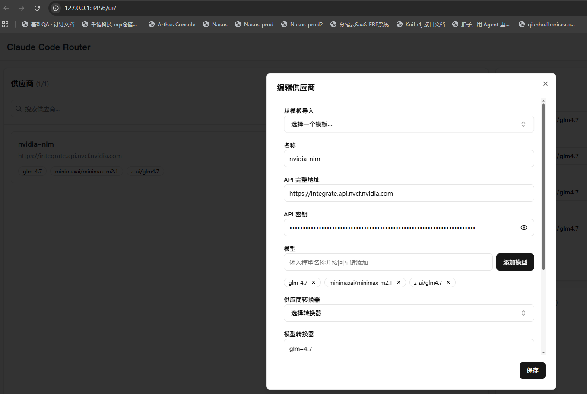
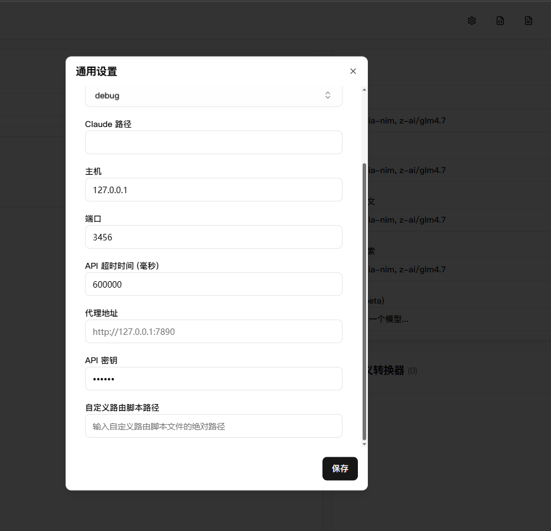
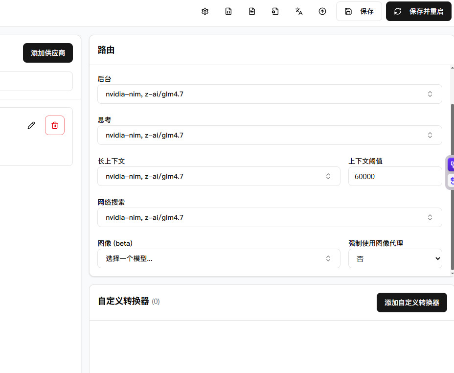
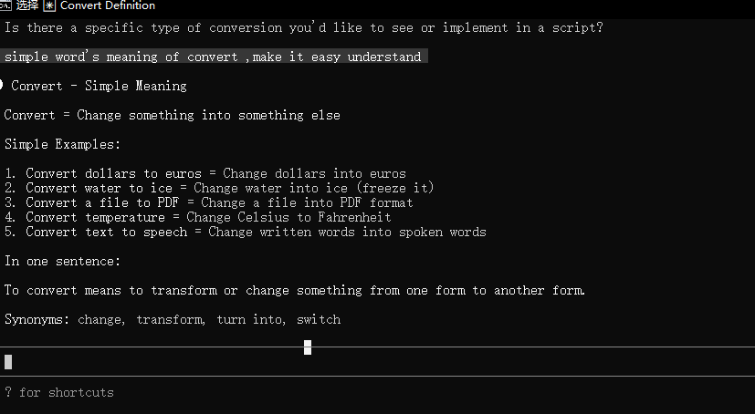
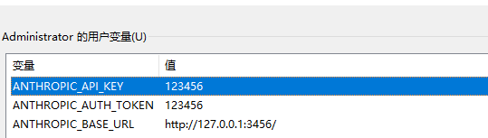

1. 第一步：获取 NVIDIA API Key
访问 NVIDIA NGC 平台：https://ngc.nvidia.com/
登录 / 注册 NVIDIA 账号（需实名认证，部分服务需绑定支付方式）。
进入「API Keys」页面（右上角头像 → Setup → API Keys）。
点击「Generate API Key」生成密钥，复制并保存（仅显示一次），建议存到安全的地方（如密码管理器）。

account :blue4wang@gmail.com 

nvidia-api-key nvapi-KkHpDG2WMKUBtjlFh4Uw9DowwGQ-RF-

2. 第二步：安装 Cloude cli 工具

3. 第三步：安装 claude-code-router 工具
https://github.com/musistudio/claude-code-router  
claude-code-router 核心作用
claude-code-router 是一个为解决「无 Anthropic 账号使用 Claude Code」及「路由 Claude Code 请求到其他大模型服务商」而生的工具，核心功能可总结为：
请求转发与格式转换Claude Code 原生仅调用 Anthropic API（api.anthropic.com），该项目通过 Express.js 实现 /v1/messages 端点，将 Claude Code 发出的 Anthropic 格式请求，转换为 OpenAI 兼容格式并路由到其他大模型服务商（如 DeepSeek、Gemini、Qwen、GLM 等），同时反向转换响应格式，让 Claude Code 能「识别」非 Anthropic 模型的返回结果。
多模型路由与适配支持按任务类型（思考、编码、长上下文、后台轻量任务等）分发请求到不同模型：
默认模型：兜底处理日常任务；
background：路由到本地 Ollama 处理轻量任务（对标 Claude Haiku 3.5）；
think：路由到 DeepSeek-R1 处理推理 / 规划任务；
longContext：处理 32K 以上长上下文场景，弥补 DeepSeek 长上下文短板；
同时通过 Transformer 接口适配不同服务商的参数差异（如 Gemini 的工具参数限制、OpenRouter 的缓存参数、DeepSeek 的 max_output 限制等）。
低成本使用 Claude Code核心目标是替代昂贵的 Anthropic 模型（如 Claude 3.5 Sonnet），转而使用低成本模型（如 DeepSeek-V3/R1，成本仅为前者 1/10），同时修复工具调用、提示词驱动等问题（如强制 DeepSeek 调用工具、引导 GLM-4.6 开启思维链）。
「配置了就可以直接用吗？」—— 并非完全「开箱即用」
该工具需要完成环境配置、代码 / 参数适配 才能正常工作，核心步骤包括：
1. 基础环境准备
依赖 Node.js（≥20.0.0）和 pnpm（≥8.0.0），需先安装；
克隆仓库后执行 pnpm install 安装依赖，再通过 pnpm build 构建项目。
2. 关键环境变量配置
Claude Code 本身支持通过环境变量覆盖核心配置，需在启动 Claude Code 前设置：
ANTHROPIC_BASE_URL：指向 claude-code-router 服务的地址（如 http://localhost:端口），让 Claude Code 的请求转发到该工具；
ANTHROPIC_API_KEY：自定义的密钥（无需真实 Anthropic 密钥），用于路由服务的鉴权；
目标模型服务商的密钥（如 DeepSeek API Key、Gemini API Key 等），需配置到 claude-code-router 的配置文件中。

4. 第四步：配置 claude-code-router 工具  

First, ensure you have Claude Code installed:
npm install -g @anthropic-ai/claude-code

Then, install Claude Code Router:
npm install -g @musistudio/claude-code-router

>ccr ui 启动界面
ccr start 启动服务

 z-ai/glm4.7  minimaxai/minimax-m2.1

https://integrate.api.nvcf.nvidia.com

配置 claude-code-router 的环境变量

ANTHROPIC_BASE_URL=http://localhost:3456
ANTHROPIC_API_KEY：自定义的密钥（无需真实 Anthropic 密钥），用于路由服务的鉴权；

目标模型服务商的密钥（如 DeepSeek API Key、Gemini API Key 等），需配置到 claude-code-router 的配置文件中,在web界面配置即可

5. 第五步：配置Claude Code for VS Code 可选插件
Claude Code for VS Code 是一个为 VS Code 设计的插件，用于与 Claude Code 服务交互。该插件提供了以下功能：
代码补全：基于 Claude Code 模型的智能代码补全功能，帮助开发者快速编写代码。
代码解释：提供代码解释功能，帮助开发者理解代码的含义。
代码调试：支持代码调试功能，帮助开发者快速定位和修复问题。

set Claude Code for VS Code 插件配置
    "claudeCode.apiKey": "123456", 
    "claudeCode.baseUrl": "http://127.0.0.1:3456"

{
    "remote.SSH.remotePlatform": {
        "localhost": "linux",
        "dev-env": "linux",
        "wsl": "linux"
    },    
    "redhat.telemetry.enabled": true,
    "[json]": {
        "editor.defaultFormatter": "vscode.json-language-features"
    },
    "dev.containers.dockerPath": "podman",
    "git.openRepositoryInParentFolders": "never",
    "claudeCode.preferredLocation": "panel",
    "claudeCode.environmentVariables": [
            
    ],
    "claudeCode.apiKey": "123456", 
    "claudeCode.baseUrl": "http://127.0.0.1:3456"
  
}

装 claude-session-manager 工具，通过 UI 批量管理 / 删除会话：
bash
运行
npm install -g @bhala-srinivash/claude-session-manager
claude-session-manager  # 浏览器打开管理界面

使用了claude-session-manager # 浏览器打开管理界面 清理回话后，vscode插件打开提示，Error loading webview: Error: Could not register service worker: InvalidStateError: Failed to register a ServiceWorker: The document is in an invalid state..

你在使用 `claude-session-manager` 清理会话后，VS Code Claude Code 插件出现「Could not register service worker」错误，核心原因是**插件的 Service Worker 缓存 / 注册状态被清理操作破坏**（Service Worker 是插件 Webview 面板的核心依赖）。下面是分步修复方案，适配 Windows 系统，能快速恢复插件正常运行：

### 一、错误本质：Service Worker 注册失败

VS Code 插件的 Webview 面板依赖浏览器级别的 Service Worker 来管理会话、缓存和通信，`claude-session-manager` 清理会话时可能误删了 Service Worker 的注册文件 / 状态，导致插件打开 Webview 时无法完成 Service Worker 注册，最终面板加载失败。

### 二、分步修复（按优先级，从简单到彻底）

#### 步骤 1：重启 VS Code + 清除 Webview 缓存（最快见效）

1.  **完全关闭 VS Code**：不仅关闭窗口，还要在任务管理器结束所有 `Code.exe` 进程（避免后台进程残留）；
2.  **清除 VS Code Webview 全局缓存**：
    
    -   打开文件资源管理器，进入路径：
        
        plaintext
        
            C:\Users\Administrator\AppData\Roaming\Code\Cache\webviews
            
        
    -   删除该目录下的**所有文件 / 文件夹**（这些是 Webview 的缓存，删除后 VS Code 会自动重建）；
    
3.  **以管理员身份重启 VS Code**，尝试打开 Claude Code 插件面板。

#### 步骤 2：重置 Claude Code 插件的 Service Worker 注册

若步骤 1 无效，手动触发插件重新注册 Service Worker：

1.  打开 VS Code，按 `Ctrl+Shift+P` 打开命令面板；
2.  输入并执行以下命令（按顺序）：
    
    -   `Developer: Reload Window`（重启窗口）；
    -   `Developer: Open Webview Developer Tools`（打开 Webview 调试工具）；
    -   在弹出的调试工具中，切换到「Application」→「Service Workers」；
    -   找到 Claude Code 插件对应的 Service Worker，点击「Unregister」注销；
    -   关闭调试工具，再次执行 `Developer: Reload Window`；
    
3.  重新打开插件面板，此时插件会重新注册 Service Worker。